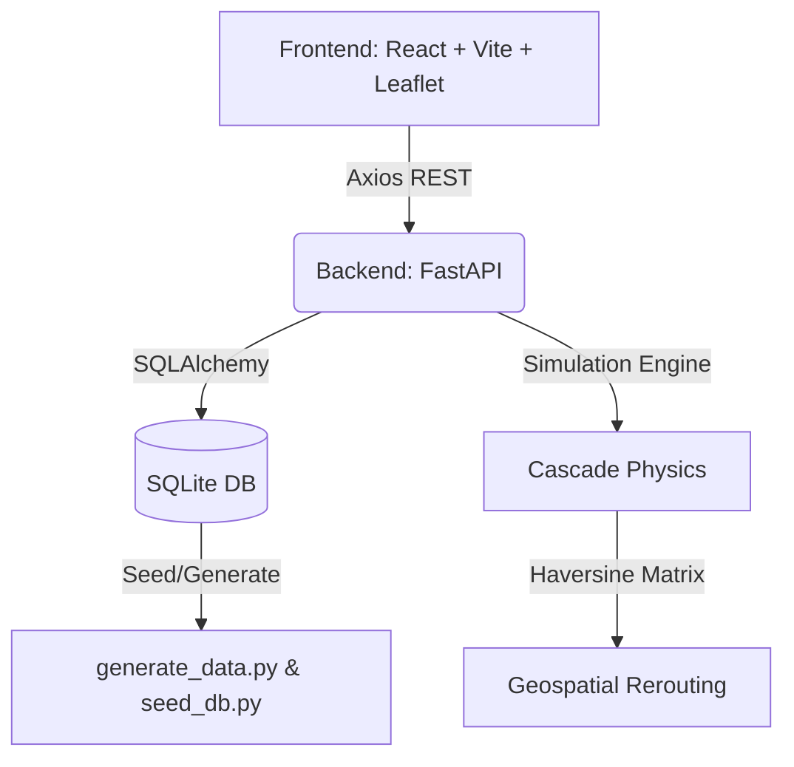

# VitalGrid Command Center & Cascade Simulator

A comprehensive simulation and management dashboard for healthcare supply chains. VitalGrid models physical constraints, predicts stockouts using moving averages, dynamically reroutes resources, and projects cascading system failures across geographical networks.

---

## 🚀 Installation & Setup

VitalGrid requires both a Python backend and a Node.js frontend. Follow these steps to manually set up and run the project from scratch on any operating system.

### Prerequisites

You will need to install the following software on your machine:
1. **Python (3.9+)**: Download and install from [python.org](https://www.python.org/downloads/). Ensure you check the box to "Add Python to PATH" during installation if you are on Windows.
2. **Node.js (v18+)**: Download and install from [nodejs.org](https://nodejs.org/). This will also install `npm`, which is required for the frontend.

---

### Step 1: Set up the Python Backend

Open a terminal or command prompt in the `VitalGrid` project directory.

**1. Create a Virtual Environment**
Isolate your Python dependencies by creating a virtual environment:
```bash
# Windows
python -m venv venv

# Linux/Mac
python3 -m venv venv
```

**2. Activate the Virtual Environment**
You must activate the virtual environment every time you want to run the backend:
```bash
# Windows
venv\Scripts\activate

# Linux/Mac
source venv/bin/activate
```

**3. Install Dependencies**
With the virtual environment activated, install the required Python packages:
```bash
pip install --upgrade pip
pip install -r requirements.txt
```

**4. Generate Data and Start the Server**
Navigate to the backend directory, generate the synthetic data, seed the database, and boot the API server:
```bash
cd backend
python generate_data.py
python seed_db.py
python -m uvicorn main:app --reload --port 8001
```
Leave this terminal window open. The backend is now running at `http://127.0.0.1:8001`.

---

### Step 2: Set up the React Frontend

Open a **second, separate terminal window** in the `VitalGrid` project directory.

**1. Install Node Dependencies**
Navigate to the frontend directory and install the required npm packages:
```bash
cd frontend
npm install
```

**2. Start the Development Server**
Launch the React frontend:
```bash
npm run dev
```
Leave this terminal window open. The frontend will boot up, and you can now access the VitalGrid Command Center in your browser at `http://127.0.0.1:5173`.

---

## 📌 Project Overview
VitalGrid was built to solve the complex problem of regional healthcare supply chain collapse during crisis events. When a hospital runs out of critical medicine (like Oxygen or Antibiotics), untreated patients are forced to travel to neighboring hospitals. This physically transfers the demand, causing the neighboring hospital's consumption to spike unpredictably, eventually triggering a vicious network-wide cascade of stockouts. 

VitalGrid provides two distinct tools:
1. **Live Command Map:** A real-time monitoring dashboard that predicts incoming stockouts across 74 facilities and suggests optimal smart-routing interventions to prevent them.
2. **Cascade Simulator:** A powerful 30-day projection engine that simulates physical logistics, stochastic demand, patient spillovers, and AI auto-interventions in an accelerated timeline.

---

## ⚙️ Core Architecture & Data Flow

**Data Flow:**
1. Background scripts generate realistic geographical and consumption data for 50 medicines across 74 hospitals, seeding a local SQLite database.
2. The FastAPI backend queries the database, runs predictive models (Weighted Moving Average), and serves the state to the React frontend.
3. In the Cascade Simulator, the frontend sends a `POST /api/simulate` request. The backend rapidly crunches a 30-day loop, resolving patient demand, logging overflow events, calculating dynamic delays, and executing auto-interventions, returning a massive JSON timeline to the frontend.
4. The React-Leaflet map visualizes this timeline asynchronously, unspooling the 30-day crisis geographically with smooth CSS animations.

---

## 🧪 Underlying Mathematics & Algorithms

VitalGrid avoids simple game-logic by grounding its simulation in mathematical forecasting and physical distances.

### 1. Weighted Moving Average (WMA) Forecast
*Used to predict the base daily demand for a medicine at a specific hospital.*
- **Math:** 
  $$Forecast = \sum_{i=1}^{7} (Consumption_{day\_i} \times Weight_i)$$
- **Weights:** `[0.05, 0.05, 0.10, 0.10, 0.20, 0.20, 0.30]` (Heavily weighting the past 3 days).
- **Application:** Calculates `base_demand`. Used to determine exactly how many "Days Until Stockout" (DUS) a hospital currently has. 

### 2. Haversine Distance Formula
*Used to calculate the straight-line Earth distance between two GPS coordinates.*
- **Formula:** 
  $$a = \sin^2(\Delta \phi / 2) + \cos \phi_1 \cdot \cos \phi_2 \cdot \sin^2(\Delta \lambda / 2)$$
  $$c = 2 \cdot \text{atan2}(\sqrt{a}, \sqrt{1-a})$$
  $$d = R \cdot c$$
- **Application:** At startup, the backend precomputes a `dist_matrix` containing the exact distance from every hospital to every other hospital in kilometers ($R = 6371$). 

### 3. Patient Spillover Friction (Cascades)
*When a hospital's stock hits 0, it drops its remaining active demand on the nearest surviving neighbor. However, patients drop off over distance.*
- **Formula:** 
  $$\text{Transfer Rate} = \max(0.2, 1.0 - (\text{Distance}_{km} \times 0.015))$$
  $$\text{Spillover} = \text{Unfulfilled Demand} \times \text{Transfer Rate}$$
- **Intuition:** For every kilometer a patient has to travel to find a new hospital, survivability drops by 1.5%. A neighbor 10km away will inherit 85% of the crisis. A neighbor 50km away will only inherit 25%.

### 4. Dynamic Supply Chain Strain
*Calculates how stressed the regional supply chain is based on network health, dynamically increasing delivery times and rationing supplies.*
- **Base Strain:** $\frac{\text{Critical Hospitals}}{\text{Total Hospitals}}$
- **Macro-Disruption Penalty (Hard Mode):** Instantly adds $+0.3$ artificial strain.
- **Rationing & Delays:**
  - `Lead Time = rand(3..5) + (Strain * rand(5..10)) + Disruption_Penalty`
  - `Order Qty = rand(25..30) - (Strain * rand(20..25)) * Disruption_Penalty`

---

## 🗺️ Key Features (Frontend & Backend)

### 1. The Command Map (Live Mode)
- **Status Calculation**: The backend scans all 50 medicines for every hospital. A hospital's overall status is bound to its *weakest link*. If it has 50 days of Oxygen but only 2 days of Antibiotics, the hospital turns Critical (Red).
- **Smart Recommendations**: Clicking a critical hospital opens the Intervention Panel. The backend scans the network to find the geographically closest hospital that has enough surplus to donate a 14-day supply without dropping its own safety stock below 30 days.

### 2. The Cascade Simulator (Projection Mode)
- **30-Day Timeline**: Projects the state of the grid over a 30-day period.
- **Macro-Disruption Mode**: A UI toggle that triggers "Hard Mode". It slashes delivery sizes, delays trucks, and forces hospitals to survive on razor-thin margins.
- **AI Auto-Intervene**: A background algorithm that runs every day of the simulation. If a hospital drops below 7 days of stock, the AI autonomously queries the Haversine matrix, deducts stock from the closest surplus neighbor, and transfers it instantly.
- **Visual Telemetry**: Real-time rendering of events. Red animated flow-lines track patient spillovers across the map. Blue dashed lines track successful AI smart-routes. 
- **Time Controls**: Variable playback speeds (0.5x, 1x, 2x) and a sidepanel drill-down that lists the exact historical event timeline for any specific hospital node you click on.

---

## 🔌 API Documentation

| Method | Route | Description |
|---|---|---|
| `GET` | `/api/network` | Returns the status, GPS coordinates, and full inventory (DUS) of all 74 facilities. |
| `GET` | `/api/alerts` | Scans the database and returns a list of warning/critical shortage alerts. |
| `GET` | `/api/recommendations/{id}` | Calculates Haversine distances to find the top 3 closest donors with surplus stock for the target facility's most critical shortage. |
| `POST` | `/api/interventions/{id}` | Deducts units from a donor facility and credits them to the target facility in the SQLite database. |
| `POST` | `/api/simulate` | Accepts `days` (int), `macro_disruption` (bool), and `auto_intervene` (bool). Returns a massive array containing the daily physical state of the grid. |

---

## 📁 Project Structure
```text
VitalGrid/
├── frontend/
│   ├── src/
│   │   ├── api/             # Axios hooks wrapping the FastAPI backend
│   │   ├── components/      # React functional components
│   │   │   ├── CommandMap.jsx       # The Leaflet map renderer
│   │   │   ├── CascadeSimulator.jsx # The 30-day simulation loop & UI
│   │   │   └── InterventionPanel.jsx# Smart-routing UI
│   │   └── index.css        # Tailwind config and custom CSS animations
│   └── package.json
│
├── backend/
│   ├── main.py              # FastAPI server, endpoints, and Simulation Math
│   ├── database.py          # SQLAlchemy models and SQLite connection
│   ├── generate_data.py     # Generates 50 medicines and 74 hospitals -> seed_data.json
│   └── seed_db.py           # Parses seed_data.json -> vitalgrid.db
│
├── start.sh                 # Universal boot script
└── requirements.txt         # Python dependencies
```

---

## ⚠️ Limitations & Future Improvements
**Known Limitations:**
- **Mock Authentication:** The frontend login screen is purely visual and does not authenticate against a real user database.
- **Single-Run DB:** `generate_data.py` overwrites the database completely every time `start.sh` is executed. Any manual interventions executed in the live dashboard will be lost upon server restart.
- **Static Medicine Demand:** Currently, hospitals consume medicine blindly based on historical trends. In reality, a hospital handling 50 overflow patients would consume significantly more resources than its baseline forecast.

**Future Architecture Roadmap:**
- Feedback loops: Allow patient spillovers to directly multiply the `base_demand` of the receiving hospital on the following day.
- Truck Pathing: Model physical trucks on the map rather than assuming instant deliveries. 
